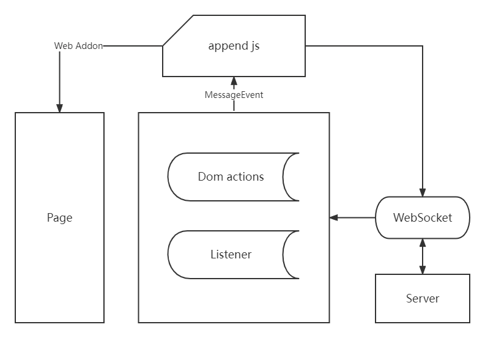

# douyin-payment-assistant

抖音支付助手，服务端控制 C 端自动获取支付页面


### 原理图



### 注意事项

目前只面向 **Android** 手机**Kiwi Browser**浏览器使用

### 开发环境

- node 16.16.0

### 环境变量

> 打包前需要配置正确的 **WebSocket** 地址

配置文件位置: packages/shell-chrome/.env.prod

```shell
# WebSocket 地址 wss://xxx.xxx.com
DOUYIN_PAYMENT_WS_URL= # 默认 ws://localhost:8084
```

### 操作命令

- 安装依赖
  - pnpm i
- 服务端启动
  - pnpm dev
- 打包
  - pnpm build

### 插件文件

`pnpm build` 后，会在项目根目录下 **zip** 文件夹下生成 _douyin-payfor-addon.zip_ 文件
